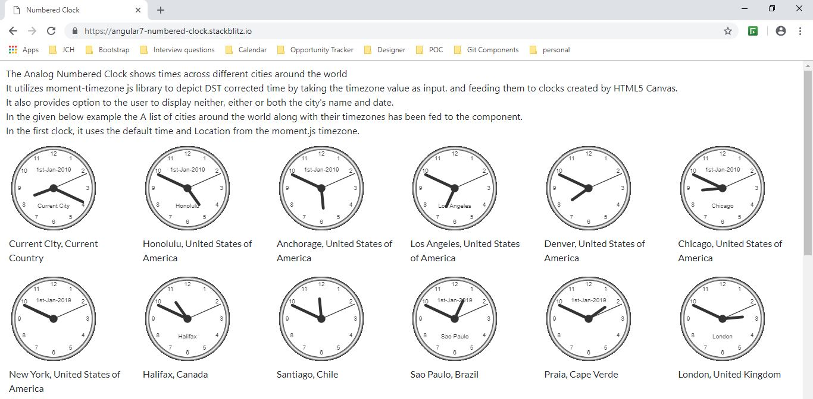
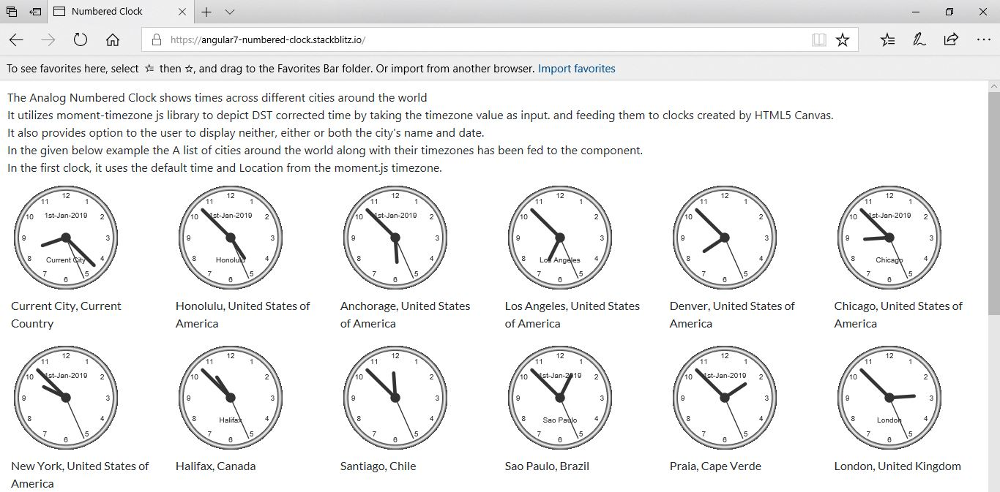
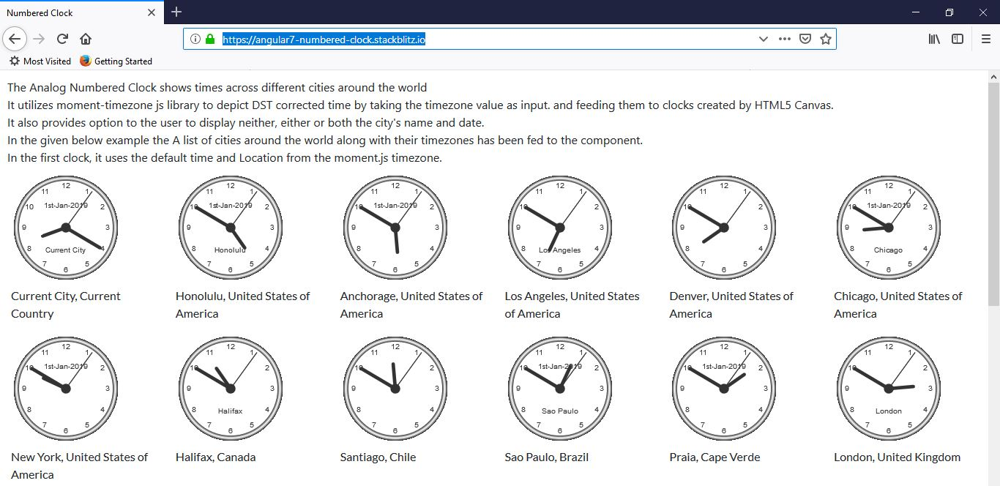
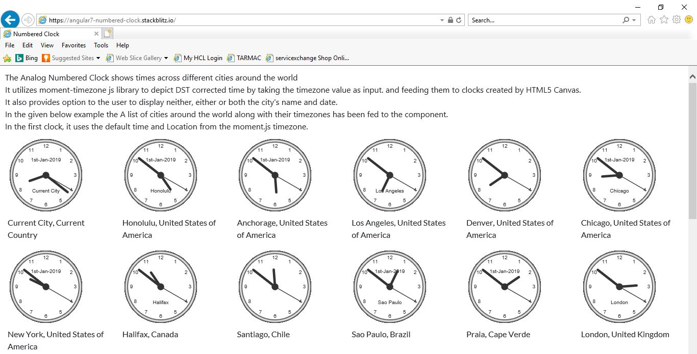
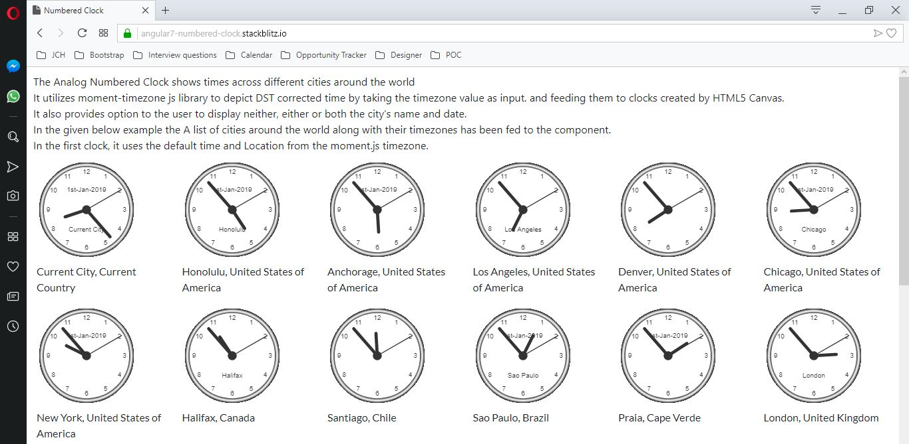

# Numbered Clock

Numbered Clock created using Angular 8, HTML5 Canvas, MomentJSTimezone displays time of cities around the world when provided with their timezone. For list of timezones kindly check- https://en.wikipedia.org/wiki/List_of_tz_database_time_zones 







## Demo

Checkout the demo on StackBlitz - https://angular8-numbered-clock.stackblitz.io/

## Adding the component in your project

### Add Component in module
Import
`
import { NumberedClockComponent } from './components/numbered-clock/numbered-clock.component';
`

Declaration
`
declarations: [
     NumberedClockComponent
  ]
`

### Add selector in HTML

```
<app-numbered-clock [city]="city.name" [timezone]="city.timezone" [displayDate]="city.displayDate" [displayName]="city.displayName"></app-numbered-clock>

```
### Selector Properties

Property `city` represents city name which user wants to display in the clock canvas like 'New York', 'Los Angeles'.
<br/>
`timezone` represents the timezone of particular city as per IANA tz database like 'America/New_York', 'America/Los_Angeles'.
If no value is provided, it tries to guess the timezone using `moment.tz.guess()`
<br/>
`displayDate` represents the option whether the user wants to display date in the format Do MMM YYYY like '1st Jan 2019' in the clock canvas. Default Value is false.
<br/>
`displayName` represents the option whether the user wants to display city name like 'New York', 'Los Angeles' in the clock canvas. Default Value is false.

### numbered-clock.component.ts
``` typescript
import { Component, OnInit, AfterViewInit, Input} from '@angular/core';
import moment from 'moment-timezone';

@Component({
  selector: 'app-numbered-clock',
  templateUrl: './numbered-clock.component.html',
  styleUrls: ['./numbered-clock.component.css']
})
export class NumberedClockComponent implements  OnInit, AfterViewInit {

  @Input() timezone;
  @Input() city;
  @Input() displayName: boolean;
  @Input() displayDate: boolean;
  public interval;
  public canvas: any;
  public ctx: any;
  public date;
  constructor() { }

  ngOnInit() {
    if (!this.timezone) {
      this.timezone = moment.tz.guess();
    }
    if (!this.city) {
      this.city = 'local';
  }
  }

  ngAfterViewInit() {
    this.canvas = <HTMLCanvasElement> document.getElementById('numberedClockCanvas-' + this.timezone + '-' + this.city);
    this.ctx = this.canvas.getContext('2d');
    let radius = this.canvas.height / 2;
    this.ctx.translate(radius, radius);
    radius = radius * 0.90;
    this.interval = setInterval(() => {
      this.date = moment().tz(this.timezone);
      this.drawClock(this.ctx, radius, this.date);
    }, 1000);
  }

  drawClock(ctx, radius, date) {
    this.drawFace(ctx, radius);
    this.drawNumbers(ctx, radius);
    this.drawTime(ctx, radius, date);
    if (this.displayName || this.displayDate) {
      ctx.textBaseline = 'middle';
      ctx.textAlign = 'center';
      ctx.translate(0, 0);
      if (this.displayDate) {
        ctx.fillText(date.format('Do-MMM-YYYY'), 0, (0.45 * -radius));
      }
      if (this.displayName) {
        ctx.fillText(this.city, 0, (0.45 * radius));
      }
      ctx.translate(0, 0);
    }
  }

  drawFace(ctx, radius) {
    let grad;
    ctx.beginPath();
    ctx.arc(0, 0, radius, 0, 2 * Math.PI);
    ctx.fillStyle = 'white';
    ctx.fill();
    grad = ctx.createRadialGradient(0, 0, radius * 0.95, 0, 0, radius * 1.05);
    grad.addColorStop(0, '#333');
    grad.addColorStop(0.5, 'white');
    grad.addColorStop(1, '#333');
    ctx.strokeStyle = grad;
    ctx.lineWidth = radius * 0.1;
    ctx.stroke();
    ctx.beginPath();
    ctx.arc(0, 0, radius * 0.1, 0, 2 * Math.PI);
    ctx.fillStyle = '#333';
    ctx.fill();
  }

  drawNumbers(ctx, radius) {
    let ang;
    let num;
    ctx.font = radius * 0.15 + 'px arial';
    ctx.textBaseline = 'middle';
    ctx.textAlign = 'center';
    for (num = 1; num < 13; num++) {
      ang = num * Math.PI / 6;
      ctx.rotate(ang);
      ctx.translate(0, -radius * 0.85);
      ctx.rotate(-ang);
      ctx.fillText(num.toString(), 0, 0);
      ctx.rotate(ang);
      ctx.translate(0, radius * 0.85);
      ctx.rotate(-ang);
    }
  }

  drawTime(ctx, radius, date) {
    let hour = date.hours();
    let minute = date.minutes();
    let second = date.seconds();
    hour = hour % 12;
    hour = (hour * Math.PI / 6) +
    (minute * Math.PI / (6 * 60)) +
    (second * Math.PI / (360 * 60));
    this.drawHand(ctx, hour, radius * 0.5, radius * 0.07);
    // minute
    minute = (minute * Math.PI / 30) + (second * Math.PI / (30 * 60));
    this.drawHand(ctx, minute, radius * 0.8, radius * 0.07);
    // second
    second = (second * Math.PI / 30);
    this.drawHand(ctx, second, radius * 0.9, radius * 0.02);
}

  drawHand(ctx, pos, length, width) {
    ctx.beginPath();
    ctx.lineWidth = width;
    ctx.lineCap = 'round';
    ctx.moveTo(0, 0);
    ctx.rotate(pos);
    ctx.lineTo(0, -length);
    ctx.stroke();
    ctx.rotate(-pos);
  }
}

```

### numbered-clock.component

``` html

<canvas id="{{ 'numberedClockCanvas-' + timezone + '-' + city }}" width="150" height="150"></canvas>

```
## Author

parasmani.jain2208@gmail.com

